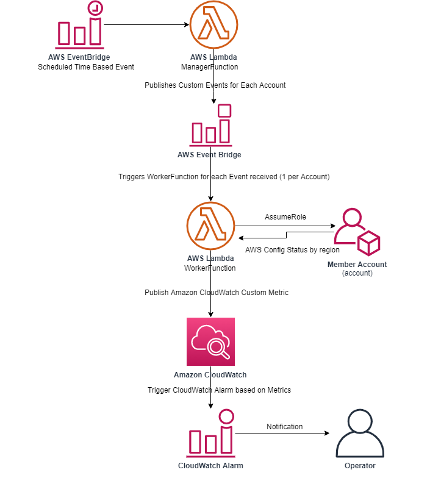
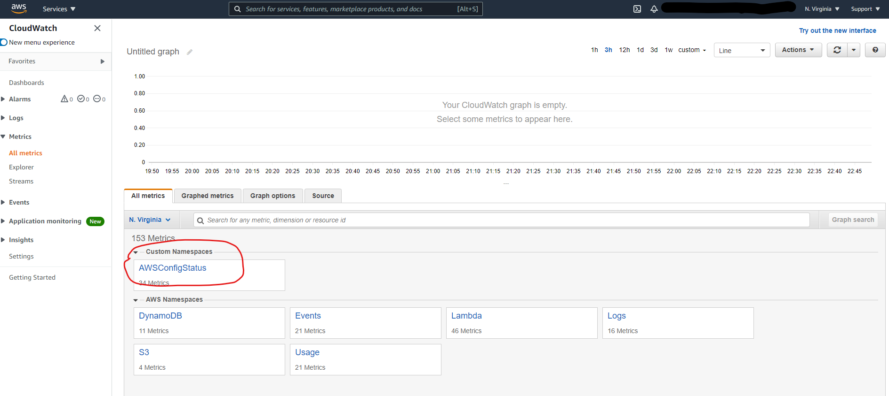
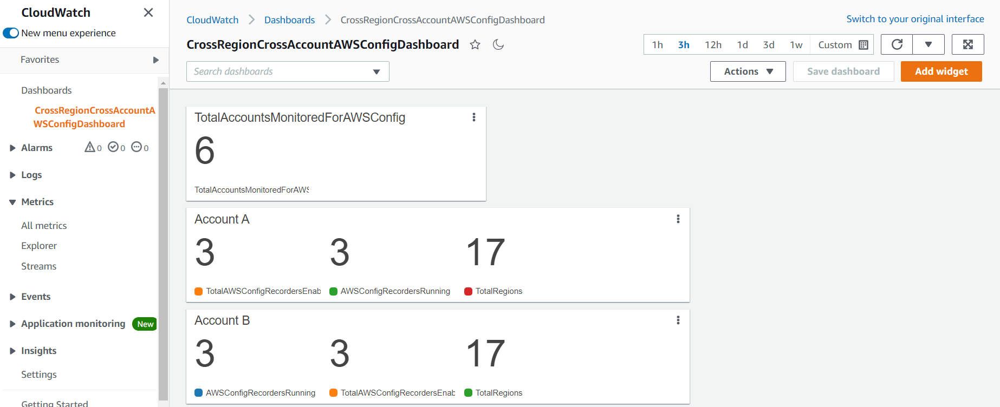

#  Implementing a cross-account and cross-Region AWS Config status dashboard

[AWS Config](https://aws.amazon.com/config/) helps central IT administrators monitor the compliance of multiple AWS accounts and multiple regions in large enterprises. AWS Config utilizes a configuration recorder to detect changes in your resource configurations and capture these as configuration items. A separate configuration recorder exists for every region in each AWS account.

However, AWS Config recorders can occasionally stop for various reasons, such as invalid delivery channel permissions, inadvertent error, etc. This Cross-Account Cross-Region AWS Config status dashboard Solution lets you monitor the status of AWS Config recorders across multiple accounts and regions via [Amazon CloudWatch custom metrics](https://docs.aws.amazon.com/AmazonCloudWatch/latest/monitoring/publishingMetrics.html) on a single management account. Then, the administrators can setup alarms on these custom metrics to be notified when the status of these AWS Config recorder changes.

This application is deployed in a management account, and the [AWS Lambda](https://aws.amazon.com/lambda/) functions access each member account and region in an [AWS Organization](https://aws.amazon.com/organizations/) or member accounts list in order to check the AWS Config recorder’s status. It then publishes the status of the AWS Config recorder for each account and region to Amazon CloudWatch as custom metrics. At this point, the operators can define [metric alarms](https://aws.amazon.com/organizations/) on these custom metrics and trigger alarm actions to notify team members via [Amazon Simple Notification Service (Amazon SNS)](https://aws.amazon.com/sns/).

## Architecture



## Prerequisites

To utilize our application, you need the following tools:

- [AWS CLI](https://aws.amazon.com/cli/) – Install the AWS CLI
- [SAM CLI](https://docs.aws.amazon.com/serverless-application-model/latest/developerguide/serverless-sam-cli-install.html) – Install the SAM CLI. The Serverless Application Model Command Line Interface (SAM CLI) is an extension of the AWS CLI that adds functionality for building and testing Lambda applications.
- Python 3.8 – Install Python
- At this time, you must launch this solution in the US East (N. Virginia) Region. However, once deployed, the solution will monitor AWS Config recorders for multiple regions and multiple AWS Accounts from the AWS CloudFormation StackSet’s target.


## Download the solution

```bash
git clone https://github.com/aws-samples/aws-multi-region-multi-account-config-status-dashboard.git
```

## How to build and deploy this application

The application has 2 directories:

- awsconfigstatuscheck-app – A SAM Application with AWS Lambda functions and AWS CloudFormation Template (template.yaml) to deploy the resources by using SAM CLI. This application is deployed in the AWS Organization management account.
- StacksetCFTemplate – This directory contains an AWS CloudFormation StackSet templatefile that defines the IAM Role and IAM Policy deployed on the member accounts. This IAM Policy and IAM Role is necessary on the member accounts for the application to assumeRole and gather AWS Config service status.

**1.** Build the application with the `sam build` command.

```bash
awsconfigstatuscheck-app$ sam build
```
<details><summary>Click to see sample output</summary>

```bash
awsconfigstatuscheck-app$ sam build
Building codeuri: /home/sundjega/TFC/awsconfigstatuschecker/awsconfigstatuscheck-app/aws_config_status_check runtime: python3.8 metadata: {} functions: ['ManagerFunction', 'WorkerFunction']
Running PythonPipBuilder:ResolveDependencies
Running PythonPipBuilder:CopySource

Build Succeeded

Built Artifacts : .aws-sam/build
Built Template : .aws-sam/build/template.yaml

Commands you can use next
=========================
[*] Invoke Function: sam local invoke
[*] Deploy: sam deploy --guided

```
</details>

**2.** This second command will package and deploy your application to AWS, with a series of prompts:

```bash
awsconfigstatuscheck-app$ sam deploy --guided --capabilities CAPABILITY_NAMED_IAM
```

* **Stack Name**: **awsconfigstatuscheck-app** 
* **AWS Region**: **us-east-1** - At this time this is the only supported region.
* **Parameter CheckFrequencyMins** - This parameter defines how often the lambda function executes to check for the AWS Config Status. Allowed Values are "rate(5 minutes)", "rate(15 minutes)", "rate(30 minutes)", "rate(60 minutes)", "rate(90 minutes)".  
* **Parameter CheckAllAccountsinOrgCondition** - If set to true, MemberAccountIds Parameter is ignored, and the application checks the status of AWS Config in all accounts/regions across the AWS Organization. If set to false, proceed to setting the MemberAccountIds parameter. Allowed Values are "true" or "false". 
* **Parameter MemberAccountIds** - If parameter CheckAllAccountsinOrgCondition is set to false, enter a comma separated list of AWS account ids where you want the application to check for AWS Config Status. Leave this parameter to it's default value, if you set CheckAllAccountsinOrgCondition to true. [Eg: 12345634344,434345555333,455454545324]
* **Confirm changes before deploy**: If set to yes, any change sets will be shown to you before execution for manual review. If set to no, the AWS SAM CLI will automatically deploy application changes.
* **Allow SAM CLI IAM role creation**: To deploy this application's AWS CloudFormation stack which creates or modifies IAM roles, the `CAPABILITY_IAM` value for `capabilities` must be provided. If permission isn't provided through this prompt, to deploy this example you must explicitly pass `--capabilities CAPABILITY_IAM` to the `sam deploy` command.
* **Save arguments to samconfig.toml**: If set to yes, your choices will be saved to a configuration file inside the project, so that in the future you can just re-run `sam deploy` without parameters to deploy changes to your application.

<details><summary>Click to see sample output</summary>

```bash

awsconfigstatuscheck-app$ sam deploy --guided --capabilities CAPABILITY_NAMED_IAM

Configuring SAM deploy
======================

        Looking for config file [samconfig.toml] :  Not found

        Setting default arguments for 'sam deploy'
        =========================================
        Stack Name [sam-app]: awsconfigstatuscheck-app
        AWS Region [us-east-1]:
        Parameter CheckFrequencyMins [rate(30 minutes)]: rate(5 minutes)
        Parameter CheckAllAccountsinOrgCondition [true]:
        Parameter MemberAccountIds [IGNORE,IF,CheckAllAccountsinOrg,TRUE]:
        #Shows you resources changes to be deployed and require a 'Y' to initiate deploy
        Confirm changes before deploy [y/N]: y
        #SAM needs permission to be able to create roles to connect to the resources in your template
        Allow SAM CLI IAM role creation [Y/n]: Y
        Save arguments to configuration file [Y/n]: Y
        SAM configuration file [samconfig.toml]:
        SAM configuration environment [default]:

        Looking for resources needed for deployment: Found!

                Managed S3 bucket: aws-sam-cli-managed-default-samclisourcebucket-1w2spd13sbzyc
                A different default S3 bucket can be set in samconfig.toml

        Saved arguments to config file
        Running 'sam deploy' for future deployments will use the parameters saved above.
        The above parameters can be changed by modifying samconfig.toml
        Learn more about samconfig.toml syntax at
        https://docs.aws.amazon.com/serverless-application-model/latest/developerguide/serverless-sam-cli-config.html


        Deploying with following values
        ===============================
        Stack name                   : awsconfigstatuscheck-app
        Region                       : us-east-1
        Confirm changeset            : True
        Deployment s3 bucket         : aws-sam-cli-managed-default-samclisourcebucket-1w2spd13sbzyc
        Capabilities                 : ["CAPABILITY_NAMED_IAM"]
        Parameter overrides          : {"CheckFrequencyMins": "rate(5 minutes)", "CheckAllAccountsinOrgCondition": "true", "MemberAccountIds": "IGNORE,IF,CheckAllAccountsinOrg,TRUE"}
        Signing Profiles             : {}

Initiating deployment
=====================

Waiting for changeset to be created..

CloudFormation stack changeset
---------------------------------------------------------------------------------------------------------------------
Operation                     LogicalResourceId             ResourceType                  Replacement
---------------------------------------------------------------------------------------------------------------------
+ Add                         AppFunctionPolicy             AWS::IAM::ManagedPolicy       N/A
+ Add                         AppFunctionRole               AWS::IAM::Role                N/A
+ Add                         AssumedFunctionRole           AWS::IAM::Role                N/A
+ Add                         CheckAllAccountsinOrgParame   AWS::SSM::Parameter           N/A
                              ter
+ Add                         ConfigAccountsParameter       AWS::SSM::Parameter           N/A
+ Add                         ManagerFunctionScheduledRul   AWS::Events::Rule             N/A
                              e
+ Add                         ManagerFunction               AWS::Lambda::Function         N/A
+ Add                         PermissionForEventsToInvoke   AWS::Lambda::Permission       N/A
                              Lambda1
+ Add                         PermissionForEventsToInvoke   AWS::Lambda::Permission       N/A
                              Lambda2
+ Add                         WorkerFunctionRule            AWS::Events::Rule             N/A
+ Add                         WorkerFunction                AWS::Lambda::Function         N/A
---------------------------------------------------------------------------------------------------------------------

Changeset created successfully. arn:aws:cloudformation:us-east-1:xxxxxxxxxxxx:changeSet/samcli-deploy1628796085/e50cc209-e848-4bc8-9af4-954872d85a30


Previewing CloudFormation changeset before deployment
======================================================
Deploy this changeset? [y/N]: y

2021-08-12 13:21:41 - Waiting for stack create/update to complete

CloudFormation events from changeset
---------------------------------------------------------------------------------------------------------------------
ResourceStatus                ResourceType                  LogicalResourceId             ResourceStatusReason
---------------------------------------------------------------------------------------------------------------------
CREATE_IN_PROGRESS            AWS::IAM::ManagedPolicy       AppFunctionPolicy             -
CREATE_IN_PROGRESS            AWS::SSM::Parameter           ConfigAccountsParameter       -
CREATE_IN_PROGRESS            AWS::IAM::ManagedPolicy       AppFunctionPolicy             Resource creation Initiated
CREATE_IN_PROGRESS            AWS::SSM::Parameter           CheckAllAccountsinOrgParame   -
                                                            ter
CREATE_IN_PROGRESS            AWS::SSM::Parameter           CheckAllAccountsinOrgParame   Resource creation Initiated
                                                            ter
CREATE_IN_PROGRESS            AWS::SSM::Parameter           ConfigAccountsParameter       Resource creation Initiated
CREATE_COMPLETE               AWS::SSM::Parameter           CheckAllAccountsinOrgParame   -
                                                            ter
CREATE_COMPLETE               AWS::SSM::Parameter           ConfigAccountsParameter       -
CREATE_COMPLETE               AWS::IAM::ManagedPolicy       AppFunctionPolicy             -
CREATE_IN_PROGRESS            AWS::IAM::Role                AppFunctionRole               -
CREATE_IN_PROGRESS            AWS::IAM::Role                AssumedFunctionRole           -
CREATE_IN_PROGRESS            AWS::IAM::Role                AppFunctionRole               Resource creation Initiated
CREATE_IN_PROGRESS            AWS::IAM::Role                AssumedFunctionRole           Resource creation Initiated
CREATE_COMPLETE               AWS::IAM::Role                AssumedFunctionRole           -
CREATE_COMPLETE               AWS::IAM::Role                AppFunctionRole               -
CREATE_IN_PROGRESS            AWS::Lambda::Function         WorkerFunction                -
CREATE_IN_PROGRESS            AWS::Lambda::Function         ManagerFunction               -
CREATE_IN_PROGRESS            AWS::Lambda::Function         WorkerFunction                Resource creation Initiated
CREATE_IN_PROGRESS            AWS::Lambda::Function         ManagerFunction               Resource creation Initiated
CREATE_COMPLETE               AWS::Lambda::Function         WorkerFunction                -
CREATE_COMPLETE               AWS::Lambda::Function         ManagerFunction               -
CREATE_IN_PROGRESS            AWS::Events::Rule             WorkerFunctionRule            -
CREATE_IN_PROGRESS            AWS::Events::Rule             ManagerFunctionScheduledRul   Resource creation Initiated
                                                            e
CREATE_IN_PROGRESS            AWS::Events::Rule             WorkerFunctionRule            Resource creation Initiated
CREATE_IN_PROGRESS            AWS::Events::Rule             ManagerFunctionScheduledRul   -
                                                            e
CREATE_COMPLETE               AWS::Events::Rule             ManagerFunctionScheduledRul   -
                                                            e
CREATE_COMPLETE               AWS::Events::Rule             WorkerFunctionRule            -
CREATE_IN_PROGRESS            AWS::Lambda::Permission       PermissionForEventsToInvoke   -
                                                            Lambda2
CREATE_IN_PROGRESS            AWS::Lambda::Permission       PermissionForEventsToInvoke   -
                                                            Lambda1
CREATE_IN_PROGRESS            AWS::Lambda::Permission       PermissionForEventsToInvoke   Resource creation Initiated
                                                            Lambda2
CREATE_IN_PROGRESS            AWS::Lambda::Permission       PermissionForEventsToInvoke   Resource creation Initiated
                                                            Lambda1
CREATE_COMPLETE               AWS::Lambda::Permission       PermissionForEventsToInvoke   -
                                                            Lambda2
CREATE_COMPLETE               AWS::Lambda::Permission       PermissionForEventsToInvoke   -
                                                            Lambda1
CREATE_COMPLETE               AWS::CloudFormation::Stack    awsconfigstatuscheck-app      -
---------------------------------------------------------------------------------------------------------------------

CloudFormation outputs from deployed stack
---------------------------------------------------------------------------------------------------------------------
Outputs
---------------------------------------------------------------------------------------------------------------------
Key                 LambdaFunction1
Description         ManagerFunction ARN
Value               arn:aws:lambda:us-east-1:xxxxxxxxxx:function:ManagerFunction

Key                 LambdaFunction2
Description         WorkerFunction ARN
Value               arn:aws:lambda:us-east-1:xxxxxxxxxx:function:WorkerFunction
---------------------------------------------------------------------------------------------------------------------

Successfully created/updated stack - awsconfigstatuscheck-app in us-east-1

```
</details>

**3.** Create a AWS CloudFormation StackSet using AWS CLI. Provide the AWS Management account Id where this StackSet will be deployed.

```bash 
StacksetCFTemplate$ aws cloudformation create-stack-set \
    --description "role/policies for aws config checker" \
    --stack-set-name aws-config-checker-stackset \
    --template-body file://stacksettemplate.yml \
    --permission-model SERVICE_MANAGED \
    --capabilities CAPABILITY_NAMED_IAM \
    --parameters ParameterKey=AdministratorAccountId,ParameterValue=<AWS_ManagementAccountId> \
    --auto-deployment Enabled=true,RetainStacksOnAccountRemoval=false
```
<details><summary>Click to see sample output</summary>

```
StacksetCFTemplate$ aws cloudformation create-stack-set \
>     --description "role/policies for aws config checker" \
>     --stack-set-name aws-config-checker-stackset \
>     --template-body file://stacksettemplate.yml \
>     --permission-model SERVICE_MANAGED \
>     --capabilities CAPABILITY_NAMED_IAM \
>     --parameters ParameterKey=AdministratorAccountId,ParameterValue=xxxxxxxxxx \
>     --auto-deployment Enabled=true,RetainStacksOnAccountRemoval=false
{
    "StackSetId": "aws-config-checker-stackset:273c07d1-c7ab-4e6c-b388-0f6e2263c400"
}

```
</details>

**4.** Create an AWS CloudFormation Stack Instances by using AWS CLI. Provide the OrganizationalUnitIds of the member accounts to which the Stack Instances are deployed.

```bash
StacksetCFTemplate$ aws cloudformation create-stack-instances \
    --deployment-targets OrganizationalUnitIds=<Organizational_Unit_Ids> \
    --stack-set-name aws-config-checker-stackset  --regions us-east-1
```
<details><summary>Click to see sample output</summary>

```
StacksetCFTemplate$ aws cloudformation create-stack-instances \
>     --deployment-targets OrganizationalUnitIds=r-xxxx \
>     --stack-set-name aws-config-checker-stackset  --regions us-east-1
{
    "OperationId": "1e740a93-e980-44e0-a4d6-6747384dab2f"
}

```
</details>

## Troubleshooting the Lambda function

In order to simplify troubleshooting, SAM CLI has a command called sam logs. sam logs lets you fetch logs generated by your deployed Lambda function from the command line. In addition to printing the logs on the terminal, this command has several useful features to help you quickly find the bug.

```bash
awsconfigstatuscheck-app$ sam logs -n WorkerFunction --stack-name awsconfigstatuscheck-app --tail
```

```bash
awsconfigstatuscheck-app$ sam logs -n ManagerFunction --stack-name awsconfigstatuscheck-app --tail
```

## View the status of AWS Config Recorders across target accounts  Amazon CloudWatch Custom Metrics.

After a few minutes login to [AWS CloudWatch Console](https://console.aws.amazon.com/cloudwatch/home?region=us-east-1#metricsV2:graph=~(view~'timeSeries~stacked~false~region~'us-east-1);namespace=~'AWSConfigStatus) to view custom metrics of AWS Config recorders by region and account. 



As shown below, you can create a [dashboard](https://docs.aws.amazon.com/AmazonCloudWatch/latest/monitoring/CloudWatch_Dashboards.html) in Amazon CloudWatch in order to view the AWSConfig Status custom metrics in a single view. Create [alarms](https://docs.aws.amazon.com/AmazonCloudWatch/latest/monitoring/AlarmThatSendsEmail.html) in CloudWatch in order to watch for a decrease in the number of running AWS Config recorders. Then, define an action in order to send a notification to an Amazon SNS Topic and/or [create an OpsItem](https://docs.aws.amazon.com/systems-manager/latest/userguide/OpsCenter-create-OpsItems-from-CloudWatch-Alarms.html) or [incident in AWS Systems Manager](https://docs.aws.amazon.com/incident-manager/latest/userguide/incident-creation.html).



## Cleanup

**1.** To delete the AwsConfigStatusChecker application that you created, use the SAM CLI. 

```bash
awsconfigstatuscheck-app$ sam delete
```
<details><summary>Click to see sample output</summary>

```
awsconfigstatuscheck-app$ sam delete
        Are you sure you want to delete the stack awsconfigstatuschecker-app in the region us-east-1 ? [y/N]: y
        Are you sure you want to delete the folder awsconfigstatuschecker-app in S3 which contains the artifacts? [y/N]: y
        - Deleting S3 object with key awsconfigstatuschecker-app/aca923a2899ecef9bb25fc9d708b2067
        - Could not find and delete the S3 object with the key awsconfigstatuschecker-app/aca923a2899ecef9bb25fc9d708b2067
        - Deleting S3 object with key awsconfigstatuschecker-app/23b0a7ffd14c825f099b0d67a2d1ae18.template
        - Deleting S3 object with key awsconfigstatuschecker-app/26d62b2b9477b02ff57126cd6a59be0b.template
        - Deleting S3 object with key awsconfigstatuschecker-app/938f74b20506773321240e7555ac4910.template
        - Deleting S3 object with key awsconfigstatuschecker-app/93c76ece26e084135707d1b4b26f053b.template
        - Deleting S3 object with key awsconfigstatuschecker-app/b93be3ce737bcac83d43d92246689245.template
        - Deleting S3 object with key awsconfigstatuschecker-app/f81beb0c1361619d6542ef6017556482.template
        - Deleting Cloudformation stack awsconfigstatuschecker-app

Deleted successfully

```
</details>

**2.** Delete the Stack Instances from AWS CloudFormation StackSet using AWS CLI.

```bash
aws cloudformation delete-stack-instances --stack-set-name aws-config-checker-stackset  --regions us-east-1 --no-retain-stacks --deployment-targets OrganizationalUnitIds=<Organizational_Unit_Ids>
```

**3.** Wait for Step 2 to finish. Then, delete the AWS CloudFormation StackSet using AWS CLI.

```bash
aws cloudformation delete-stack-set --stack-set-name aws-config-checker-stackset
```

## Conclusion

This post provided a solution that can be easily deployed on a management account in order to monitor the status of AWS Config recorders on multiple accounts and regions. The solution publishes custom metrics to Amazon CloudWatch. AWS administrator and operators can setup CloudWatch alarms to be notified when the status of an AWS Config recorder’s status changes for any reason .
